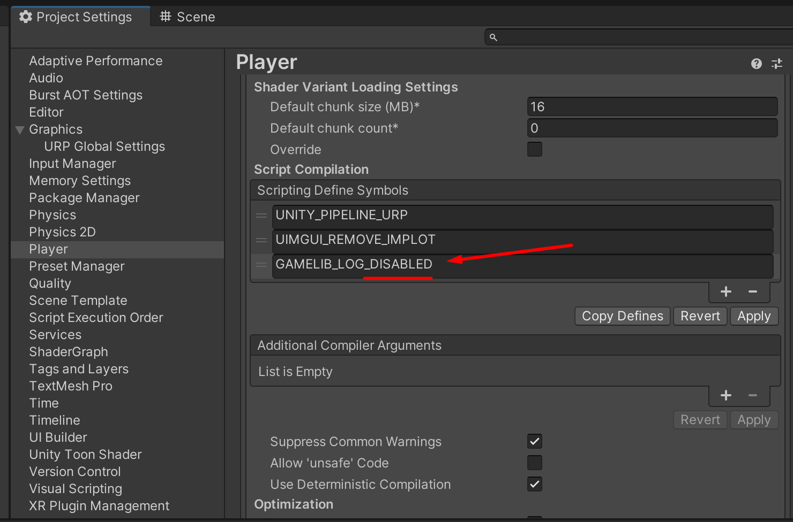
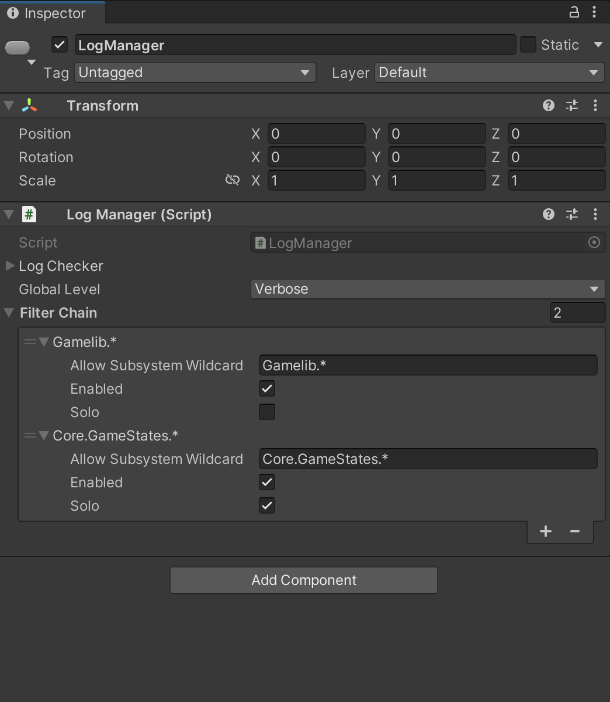
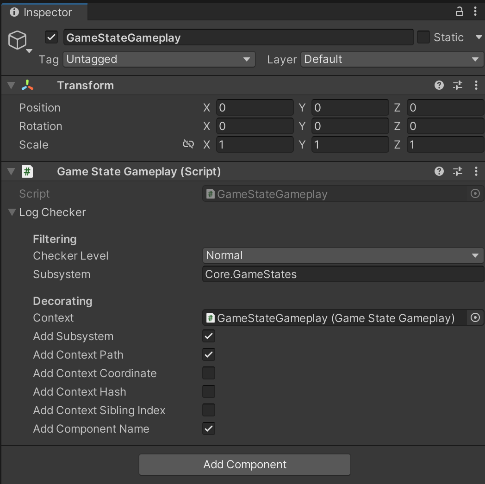

# Gamelib.Log subsystem

## Overview

Gamelib logging system manages and decorates log messages. The idea behind the design is to deside at runtime which message need to be output and which doesn't, unlike the principle of output everything and filter out later. The advantage of such design is that we don't process the text preparation for the messages that we don't need in log.

### Setup
To enable Gamelib.Log subsystem add GAMELIB_LOG symbol to Projects Settings -> Player -> Other Settings -> Script Compilation (Scripting Define Symbols)

To disable Gamelib.Log and cut off all text messages from the build simply add _DISABLED suffix to GAMELIB_LOG symbol. When you need to enable log back you can simply remove _DISABLED suffix. So you don't need to memorize name of the compilation directive symbol.


### LogManager
To configure project logging use LogManager script. It has setup for subsystem filtering and global log level variable.



*** todo: DESCRIBE GLOBAL LEVEL***
Global level of LogManager:
Important -> will pass only Important messages
Normal -> will pass Important and Normal messages
Verbose -> will pass all types of messages


## Filtering


*** todo: DESCRIBE CHECKER LEVEL ***
*** todo: DECORATING ***


## Decorating the text message


## Implementation details


Let's assume we have LogManager with GlobalLevel set to Normal. In this case Verbose messages will not pass the filtering. 

```
public class TestMethodRemoving : MonoBehaviour
{
    private LogChecker log = new LogChecker(LogChecker.Level.Normal);

    void Start()
    {
        log.Print(LogChecker.Level.Verbose, $"calculations {HeavyCalculationMethod(1, 1)}");
        log.Print(LogChecker.Level.Verbose, () => $"calculations {HeavyCalculationMethod(1, 1)}");
    }

    public int HeavyCalculationMethod(int a, int b)
    {
        print("Processor is on fire!");
        return a + b;
    }
}
```
In this example both messages will not pass level filtering. The first Print will cause "heavy" calculations inside string interpolation even if we don't need the resulting output string. In this case when you have heavy logic in your string interpolation you may use 2 options. First option is to use overloaded method for postponed evaluation as in the second line. Another option would be to use the explicit checks:

```
    if (logChecker.Normal() && logChecker.IsFilterPass())
        Debug.Log($"calculations {HeavyCalculationMethod(1, 1)}")
```
or
```
    if (logChecker.Normal() && logChecker.IsFilterPass())
        logChecker.($"calculations {HeavyCalculationMethod(1, 1)}")
```


