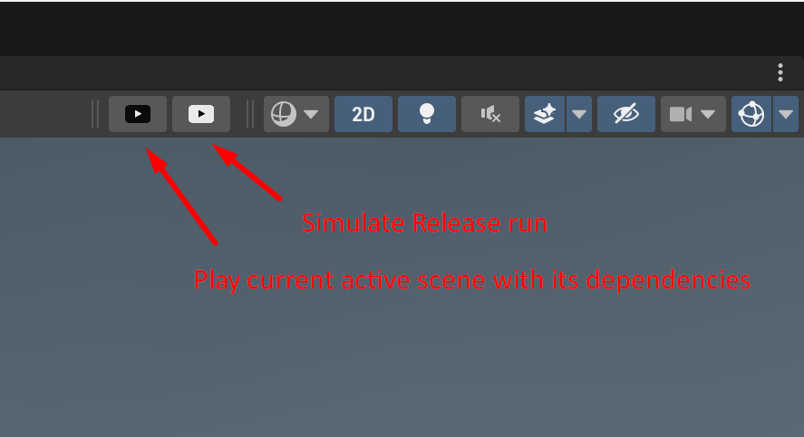

# GameLib Scene Management

## Overview

This GameLib Scene Management subsystem provides a set of scripts that simplify scene management in Unity projects during development process. It includes the following components:

1. **SceneLoader**: A class that handles the loading, unloading, and replacing of scenes in Unity. It offers a set of public methods to interact with the scene loading process. It has a feature of loading sequence of scenes (dependencies) based on the name of one specific scene. 

2. **SceneDependenciesConfig**: A ScriptableObject that acts as a configuration file for defining scene dependencies and loading sequences. It allows you to set loading sequences for individual scenes or groups of scenes using wildcard patterns. Typically used only for development purposes.

3. **EditorPlayWithDependencies**: A custom editor toolbar button script that lets you play the current active scene along with its dependencies in the Unity editor.

4. **EditorPlayAsRelease**: Another custom editor toolbar button script that simulates playing the game in release mode in the Unity editor.

## Usage

### SceneLoader

The `SceneLoader` class is responsible for loading, unloading, and replacing scenes. To use it, follow these steps:

1. Attach the `SceneLoader` script to an empty GameObject in your scene.

2. Create a `SceneDependenciesConfig` ScriptableObject asset (Create > GameLib/Scene/SceneDependenciesConfig) to define the loading sequences for your scenes. See examples in GameLibSandbox ( https://github.com/cholushkin/GameLibSandbox/tree/master/GameLibSandboxUnity/Assets/Settings).

3. Configure the `AllSceneDependencies` array in the `SceneDependenciesConfig` asset, providing scene names (or wildcard patterns) along with their corresponding loading sequences. It's a good practice to end the list with wildcard '*' specifying the default depedecnies. 

4. In your scripts, you can use the `SceneLoader` instance to load, unload, or replace scenes using the provided public methods (`Load`, `Unload`, `Replace`).

### Editor Special Play Buttons

The editor special play buttons are custom toolbar buttons and overlays in the Unity editor. They provide convenient way for testing scenes during development process. To access a toolbar containing special play buttons press "Overlay menu" in the scene right corner then choose "Gamelib toolbar".

1. **EditorPlayWithDependencies**: This button, represented by the black play icon, allows you to play the current active scene along with its dependencies. Clicking this button sets the active scene in the `SessionState`, and then it triggers the play mode with scene dependencies.

2. **EditorPlayAsRelease**: This button, represented by the white play icon, simulates playing the game in release mode. Clicking this button sets the starting scene to the first scene in the build settings and triggers the play mode. The first scene must always contain a SceneLoader object which has release scene loading sequence.

If the scene you're working on right now doesn't require core objects like a log manager, a sound manager, some analytics and so on, you can run them in standard way by hitting Play in the Editor.

