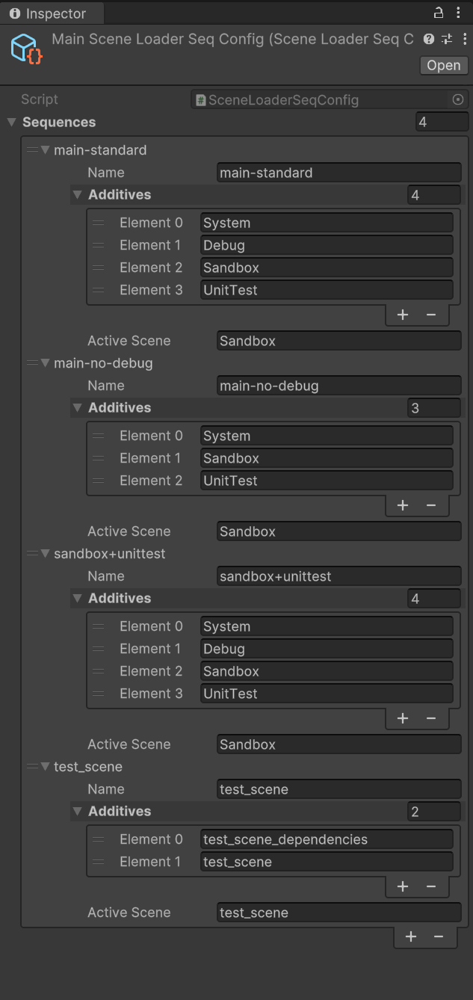
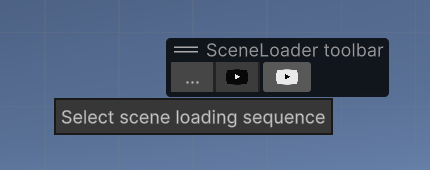

# GameLib SceneLoader

## Problem Solved by SceneLoader

SceneLoader addresses two primary issues during game development:
1. The need to run a specific scene independently, with a set of supporting scenes, outside the context of the entire game.
2. The requirement to change the starting set of scenes and their loading sequence when the game is launched.

Developers often organize various objects, such as logs, consoles, different contexts, meta-game elements, and gameplay components, across different additively loaded scenes. Sometimes, there's a need to run a specific scene in isolation from the rest of the game. SceneLoader allows defining dependencies for each scene and enables loading a scene along with its dependent scenes, ignoring currently loaded scenes in the hierarchy with a single click.

### SceneLoader Design Points

- Using `SceneLoaderSeqConfig`, developers can define named sequences of scene loads: 
    - For example:
        - `main-standard`: Defines the sequence of scenes for standard game loading as in the release.
        - `main-no-debug`: Defines the sequence of scenes for standard game loading as in the release, but without the debug scene.
        - `test_scene`: Matches the name of the `test_scene` for convenience and ensures the isolated loading of the test scene along with `test_scene_dependencies`.
- Isolated scene loading is technically implemented as a regular game start but with an overridden loading sequence, replacing `main-standard` with the `test_scene` sequence at the start.
- Developers have three ways to start scenes:
    1. **Standard Unity Way**: Using the Play button. This will launch all the scenes currently loaded in the hierarchy.
    2. **Play Selected Scene Sequence**:  (black play button). Loads only the selected sequence from the dropdown, such as `test_scene`.
    3. **Play the Game as Release**: (white button). Starts the game with the release set of scenes (`main-standard` sequence).

### Project Organization to Utilize SceneLoader

- **Starting Scene**: Add the starting scene to the `BuildProfiles` scene list as index 0. The recommended name for this scene is `Main` (serving as the entry point for the game). This scene must contain the `SceneLoader` with the standard game start sequence (`main-standard` from the example).
- Be carefull: don't add Main scene in any sequence, it will be loaded automatically for any sequence
- **SceneDependenciesConfig**: This configuration should specify the sequences for each scene that the developer wants to run in isolation. The config name must start with `Main` (e.g., `MainSceneLoaderSeqConfig`).
- To access a toolbar containing special play buttons press "Overlay menu" in the scene right corner then choose "SceneLoader toolbar".